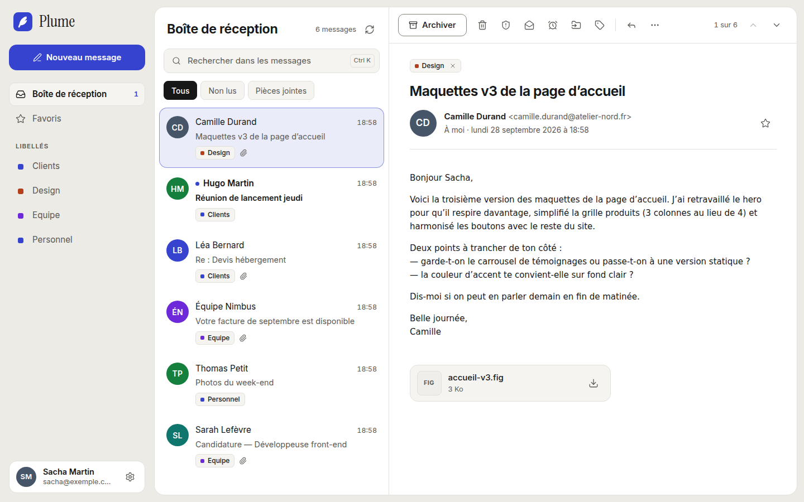
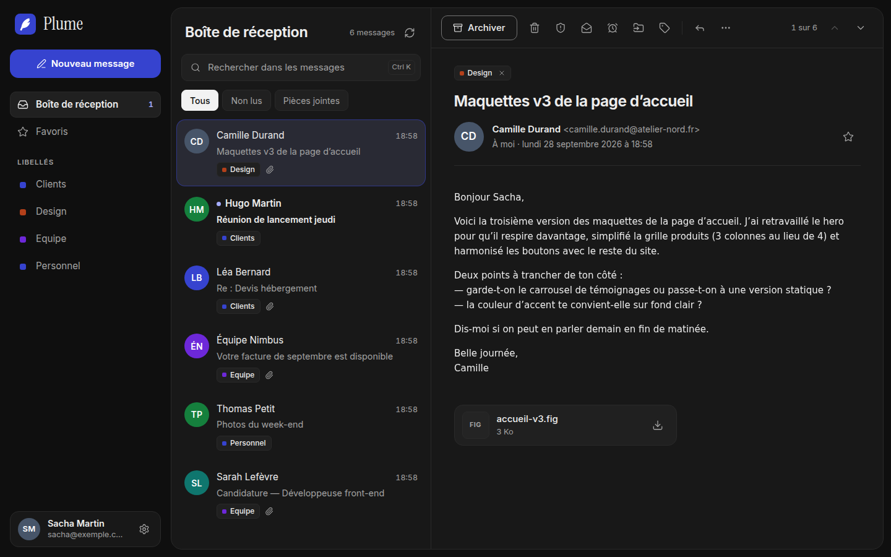
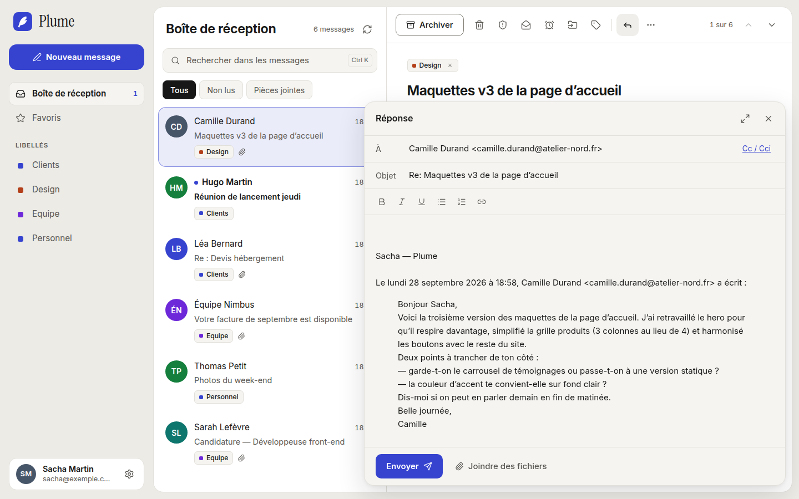
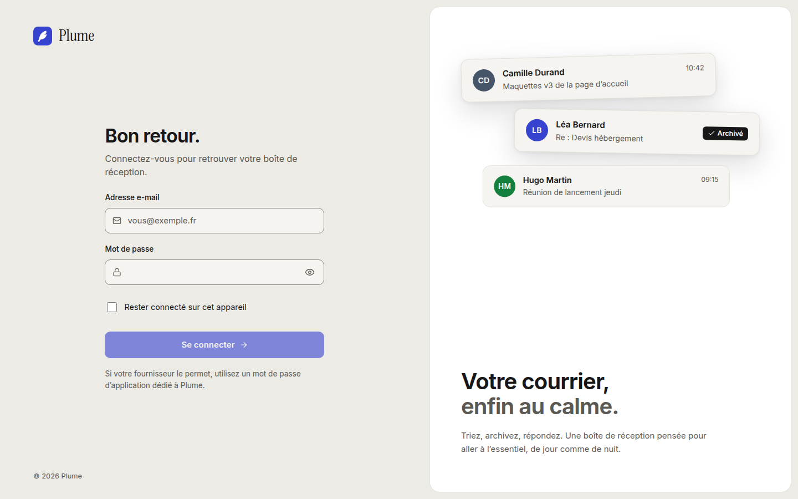
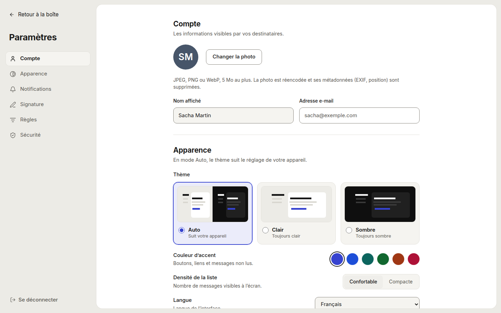
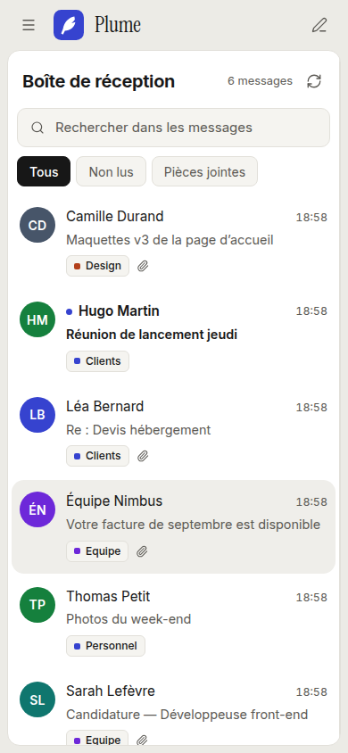

<p align="center">
  
</p>

<h1 align="center">Plume</h1>

<p align="center">Webmail auto-hébergé, sécurisé et moderne pour vos serveurs IMAP/SMTP</p>

<p align="center">
  
</p>

Webmail moderne et auto-hébergé : une interface web rapide au-dessus de vos serveurs IMAP/SMTP
existants, avec une liste blanche de domaines, un second facteur (TOTP) et un moteur de règles
exécuté côté serveur.

> Plume ne stocke pas les messages : le serveur IMAP reste la source de vérité. Plume conserve
> seulement les comptes (identifiants chiffrés), les préférences, les règles et le journal
> d'audit.

## Aperçu

| Thème sombre                                                                    | Rédaction d'une réponse                                                                 |
| ------------------------------------------------------------------------------- | --------------------------------------------------------------------------------------- |
|  |  |
| **Connexion**                                                                   | **Paramètres**                                                                          |
|                      |        |

<p align="center">
  
</p>

## Sommaire

- [Fonctionnalités](#fonctionnalités)
- [Fonctionnement](#fonctionnement)
- [Installation](#installation)
- [Configuration](#configuration)
- [Cas courants](#cas-courants)
- [Exploitation](#exploitation)
- [Développement](#développement)

## Fonctionnalités

- **Lecture** : dossiers, libellés (mots-clés IMAP), recherche, filtres (non lus, pièces
  jointes), favoris, aperçu des PDF et images, mail affiché en entier dans une zone isolée,
  images distantes bloquées par défaut.
- **Actions** : archiver, supprimer, signaler comme indésirable, déplacer (menu ou
  glisser-déposer), reporter à plus tard, marquer lu/non lu, avec « Annuler » pendant quelques
  secondes.
- **Rédaction** : éditeur riche, réponse / réponse à tous / transfert avec citation, signature,
  pièces jointes, fenêtre agrandissable, brouillons (proposés à la fermeture, repris ensuite).
- **Comptes** : plusieurs comptes dans la même session avec bascule, second facteur TOTP
  (facultatif ou obligatoire), codes de secours, déconnexion de tous les appareils.
- **Règles** : trier, libeller, transférer, répondre automatiquement — exécutées par le serveur
  dès l'arrivée du message (IMAP IDLE), même navigateur fermé ; résumé quotidien.
- **Interface** : thème clair/sombre/automatique, couleur d'accent, densité, français et
  anglais, utilisable au clavier et sur mobile, accessibilité vérifiée (axe).

## Fonctionnement

```
 navigateur ──HTTPS──▶ Caddy ──┬─▶ fichiers de l'interface (React)
                               └─▶ /api ──▶ api (Fastify) ──┬─▶ PostgreSQL (comptes, règles, audit)
                                                           ├─▶ Redis (sessions, files de tâches)
                                                           └─▶ serveur IMAP/SMTP du domaine
                                  worker (règles, reports, résumés) ──┘
```

| Service    | Rôle                                                                            |
| ---------- | ------------------------------------------------------------------------------- |
| `caddy`    | HTTPS (certificat automatique), en-têtes de sécurité et CSP, interface web      |
| `api`      | API REST `/api/v1` : authentification, messages, règles, préférences            |
| `worker`   | Exécute les règles à l'arrivée des messages, réveille les reports, résumés      |
| `postgres` | Base de données (aucun contenu de message)                                      |
| `redis`    | Sessions et files de tâches                                                     |
| `backup`   | Sauvegardes régulières de la base                                               |
| `secrets`  | Génère clé maître et mots de passe internes au premier démarrage, puis s'arrête |

**Connexion.** L'utilisateur saisit son adresse et le mot de passe de sa boîte. Plume déduit le
domaine de l'adresse, vérifie qu'il figure dans la liste blanche (et, si elle est définie, que
le compte fait partie des comptes autorisés), puis tente une connexion IMAP **sur le serveur
configuré pour ce domaine** — jamais sur un hôte fourni par l'utilisateur. En cas de succès, le
mot de passe est chiffré (AES-256-GCM, clé maître) pour les accès ultérieurs et pour le moteur
de règles.

**Lecture.** Chaque action de l'interface devient une commande IMAP sur la boîte de
l'utilisateur. Le HTML des mails est nettoyé côté serveur puis affiché dans une zone isolée
(iframe sans accès à la session), les images distantes passent par un proxy signé.

**Envoi.** Le message est construit par le serveur (l'expéditeur est toujours le compte
connecté) et envoyé au serveur SMTP du domaine, avec les identifiants de la boîte ou ceux d'un
relais commun, puis copié dans « Envoyés ».

Détails : [modèle de sécurité](docs/SECURITY.md), [décisions techniques](docs/DECISIONS.md),
[exploitation](docs/OPERATIONS.md).

## Installation

Prérequis : un serveur Linux avec **Docker Engine 26+** et **Compose 2.26+**, un nom de domaine
pour le webmail (ex. `mail.exemple.com`) pointant vers ce serveur, ports 80 et 443 ouverts (ou
un reverse proxy existant, voir plus bas), et un serveur de messagerie IMAP/SMTP existant.

1. **Récupérer le code**

   ```sh
   git clone https://github.com/<organisation>/plume.git
   cd plume
   ```

2. **Écrire la configuration** à partir de l'exemple (détaillé [plus bas](#configuration)) :

   ```sh
   cp config/plume.example.yaml config/plume.yaml
   $EDITOR config/plume.yaml   # domaines autorisés, serveurs IMAP/SMTP, public_url
   ```

3. **Indiquer le nom public** du webmail (utilisé par Caddy pour le certificat) :

   ```sh
   echo "PLUME_SITE_ADDRESS=mail.exemple.com" > .env
   ```

   `server.public_url` dans `config/plume.yaml` doit valoir `https://mail.exemple.com`.

4. **Vérifier puis démarrer**

   ```sh
   docker compose run --rm --no-deps api node dist/cli.js check-config
   docker compose up -d --build --wait
   ```

   Au premier démarrage, le service `secrets` génère la clé maître et les mots de passe internes
   dans le volume Docker `plume_secrets` (jamais sur l'hôte), puis s'arrête : l'état
   « Exited (0) » est normal. Caddy obtient automatiquement un certificat Let's Encrypt.

5. **Se connecter** sur `https://mail.exemple.com` avec l'adresse et le mot de passe d'une boîte
   d'un domaine autorisé. Le second facteur s'active dans _Paramètres › Sécurité_.

Pour un essai local sans nom de domaine, laisser `PLUME_SITE_ADDRESS` vide : l'instance répond
sur `https://localhost` avec un certificat de l'autorité locale de Caddy.

**Mettre à jour** : `git pull && docker compose up -d --build --wait` (les migrations de la base
s'appliquent au démarrage de l'API).

## Configuration

Le fichier `config/plume.yaml` est validé au démarrage : un champ inconnu ou invalide empêche le
démarrage avec un message explicite. Aucun secret n'y figure en clair (références `*_file` ou
`*_env`). Exemple commenté :

```yaml
server:
  # Adresse publique du webmail (contrôle d'origine anti-CSRF).
  public_url: https://mail.exemple.com
  # Réseaux dont on accepte X-Forwarded-For (le réseau Docker de Caddy).
  trusted_proxies: ['172.16.0.0/12']

# Liste blanche : seuls ces domaines peuvent se connecter. Chaque domaine indique SON serveur
# IMAP/SMTP ; l'hôte n'est jamais choisi par l'utilisateur.
domains:
  - domain: exemple.com
    imap: { host: imap.exemple.com, port: 993, security: tls }
    smtp: { host: smtp.exemple.com, port: 465, security: tls }

  # Sous-domaines (a.exemple.org, b.exemple.org…), pas exemple.org lui-même.
  - domain: '*.exemple.org'
    imap: { host: mail.exemple.org, port: 993, security: tls }
    smtp: { host: mail.exemple.org, port: 587, security: starttls }
    login_format: local_part # le serveur attend « sacha » plutôt que « sacha@… »

  # Seulement certains comptes de ce domaine.
  - domain: equipe.exemple.net
    accounts: [sacha, alex@equipe.exemple.net]
    imap: { host: imap.exemple.net, port: 993, security: tls }
    smtp: { host: smtp.exemple.net, port: 465, security: tls }

auth:
  session_ttl: 12h # durée maximale d'une session
  idle_timeout: 30m # déconnexion après inactivité
  remember_me_ttl: 30d # « Rester connecté »
  totp: optional # disabled | optional | required
  rate_limit:
    per_ip: { max: 10, window: 15m }
    per_account: { max: 5, window: 15m, lockout: 30m }

security:
  master_key_file: /run/secrets/plume_master_key # généré par le service « secrets »
  remote_images: block_by_default # block_by_default | allow
  max_attachment_size: 25MB
  max_upload_total: 50MB

rules:
  enabled: true
  max_rules_per_user: 100
  forward:
    enabled: true
    allowed_destination_domains: ['exemple.com'] # vide = transfert automatique interdit

database:
  url_file: /run/secrets/database_url
redis:
  url_file: /run/secrets/redis_url

logging:
  level: info # debug | info | warn | error
  format: json
```

Les changements de `domains`, `auth.rate_limit` et `rules` se rechargent **sans redémarrage** :
`docker compose kill -s HUP api worker` (un fichier invalide est refusé, l'ancienne
configuration reste active). Un domaine ou un compte retiré est immédiatement déconnecté. Les
autres réglages demandent `docker compose up -d`.

## Cas courants

**Reverse proxy déjà en place** (nginx, Traefik…) : Caddy écoute alors en HTTP sur un port local.
Dans `.env` :

```sh
COMPOSE_FILE=compose.yaml:deploy/docker-compose.behind-proxy.yml
PLUME_LOCAL_PORT=8080
```

puis faire pointer le proxy vers `http://127.0.0.1:8080` (exemple nginx dans
[docs/OPERATIONS.md](docs/OPERATIONS.md#derrière-un-reverse-proxy-existant)). `public_url`
reste l'adresse publique en `https://`.

**Relais SMTP avec un compte différent des boîtes** (prestataire d'envoi, relais du FAI) :

```yaml
smtp:
  host: smtp-relay.fournisseur.example
  port: 587
  security: starttls
  auth:
    username: relais@exemple.com
    password_env: PLUME_SMTP_RELAY_PASSWORD # valeur dans .env
```

**Serveur de messagerie dans un autre conteneur de la même machine** : garder le vrai nom
(`imap.exemple.com`, qui correspond au certificat) et le faire pointer vers l'hôte avec
`extra_hosts: ['imap.exemple.com:host-gateway']` sur les services `api` et `worker` (fichier de
surcharge Compose), ou rejoindre le réseau Docker du serveur de messagerie.

**Message « Requête refusée par mesure de sécurité »** : `public_url` ne correspond pas à
l'adresse utilisée dans le navigateur ; `docker compose logs api | grep origine` affiche les deux.

## Exploitation

Sauvegardes et restauration, rotation de la clé maître, supervision, journal d'audit, incidents :
voir [docs/OPERATIONS.md](docs/OPERATIONS.md).

```sh
docker compose ps                                  # état des services
docker compose logs -f api worker                  # journaux
docker compose kill -s HUP api worker              # recharger la configuration
docker compose exec backup plume-backup now        # sauvegarde immédiate
```

## Développement

Prérequis : Node.js 22, pnpm 10 (`corepack enable`), Docker (tests d'intégration).

```sh
pnpm install
make test                  # lint + format + types + tests unitaires et d'intégration
pnpm --filter @plume/web dev
```

Tests de bout en bout (Playwright) contre la pile Docker et un serveur de test GreenMail :

```sh
COMPOSE_FILE=compose.yaml:deploy/docker-compose.e2e.yml docker compose up -d --build --wait
pnpm --filter @plume/e2e test
```

Comptes de test (GreenMail) : `sacha@exemple.com` / `e2e-password`, `alice@exemple.com` /
`e2e-password-alice`.

| Dossier           | Rôle                                                       |
| ----------------- | ---------------------------------------------------------- |
| `apps/api`        | API Fastify (authentification, mails, règles, préférences) |
| `apps/worker`     | Moteur de règles (IMAP IDLE + BullMQ), reports, résumés    |
| `apps/web`        | Interface React                                            |
| `packages/config` | Chargement et validation du YAML (Zod), liste blanche      |
| `packages/db`     | Schéma Drizzle, client PostgreSQL, migrations SQL          |
| `packages/rules`  | Modèle et évaluation des règles (pur, sans I/O)            |
| `packages/mail`   | IMAP / SMTP, nettoyage HTML                                |
| `packages/crypto` | Chiffrement des identifiants, TOTP                         |
| `packages/shared` | Types, journalisation, utilitaires partagés                |
| `deploy/`         | Fichiers Compose, `Caddyfile`, images                      |
| `docs/`           | Sécurité, décisions, exploitation, OpenAPI                 |

L'API REST est décrite en OpenAPI 3.1 dans [docs/openapi.json](docs/openapi.json), produite à
partir des schémas de validation (`pnpm --filter @plume/api openapi`) ; un test échoue si elle
n'est pas à jour.

## Sécurité

Modèle de menaces, protections et signalement des vulnérabilités :
[docs/SECURITY.md](docs/SECURITY.md).

## Licence

[GNU AGPL v3 ou ultérieure](LICENSE). Si vous proposez une version modifiée de Plume à des
utilisateurs via le réseau, vous devez leur donner accès à son code source.
